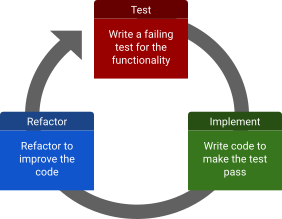

<!-- _class: title -->
<!-- _paginate: false -->
<!-- _footer: "Last updated: 2026-07-20" -->

# Agentic Test-Driven Development

## Liam Keegan, SSC

---

# Course Outline

- Coding with LLMs
- Testing with LLMs
- Software testing best practices
- Hands on test-driven development
- Hands on spec-driven development
- Hands on vibe coding
- Classical TDD intro
- Agentic TDD: what changes, what stays the same
- Common failure modes
- Best practices
- Hands on
  - Could be fully hands on
    - But hard to coordinate, each student will rapidly diverge
  - Could be just me coding
    - Students interacting with me as we discuss what to do next, pros/cons of different approaches

---

<!-- _class: subtitle -->

# Coding with LLMs

---

# 1960 - 2020: Humans write code

Software development has been around for many decades.

In that time, new programming languages and methods were developed, and many things changed - but the basic paradigm of humans writing code didn't really change.

---

# 2023: LLMs can write code

It turns out LLMs can (sort of) generate (sometimes working) code from plain english prompts.

> **Andrej Karpathy** @karpathy
>
> The hottest new programming language is English
>
> Jan 2023
> https://x.com/karpathy/status/1617979122625712128

---

# 2024: Hype

Although not everyone is impressed.

> **Linus Torvalds** torvalds@linuxfoundation.org
>
> [...] it’s 90 percent marketing and ten percent reality [...]
>
> Oct 2024
> https://www.theregister.com/software/2024/10/29/linus-torvalds-90-of-ai-marketing-is-hype-so-i-ignore-it/390369

---

# 2025: Vibe coding

You can (more or less) code fun projects, without understanding the code, just by talking to the model.

> **Andrej Karpathy** @karpathy
>
> There's a new kind of coding I call "vibe coding" [...] it's not really coding - I just see stuff, say stuff, run stuff, and copy paste stuff, and it mostly works.
>
> Feb 2025
> https://x.com/karpathy/status/1886192184808149383

---

# 2026: Agentic engineering

LLMs are now good enough at coding to be used by professional developers in serious projects.

> **Andrej Karpathy** @karpathy
>
> programming via LLM agents is increasingly becoming a default workflow for professionals [...] to differentiate it from vibe coding, personally my current favorite "agentic engineering" [...]
>
> Feb 2026
> https://x.com/karpathy/status/2019137879310836075

---

# 2026: Agentic engineering

Even endorsed by Linus!

> **Linus Torvalds** torvalds@linuxfoundation.org
>
> AI is a tool, just like other tools we use.  And it's clearly a useful one. [...] Anybody who doubts that clearly hasn't actually used it.
>
> July 2026
> https://lore.kernel.org/linux-media/CAHk-=wi4zC+Ze8e+p3tMv8TtG_80KzsZ1syL9anBtmEh5Z40vg@mail.gmail.com/

---

# Keeping up

If you feel like it's hard to keep up with this dramatic rate of change, you're not alone!

> **Andrej Karpathy** @karpathy
>
> I've never felt this much behind as a programmer [...] I have a sense that I could be 10X more powerful if I just properly string together what has become available [...] some powerful alien tool was handed around except it comes with no manual and everyone has to figure out how to hold it and operate it [...]
>
> Dec 2025
> https://x.com/karpathy/status/2004607146781278521

---

# Advantages of coding with LLMs

- Can generate **a lot** of **working** code **very quickly**, even without understanding it

In what scenarios is this an advantage?

- Rapid prototyping of new ideas
- Writing one-off scripts
- Code where it is obvious when it works correctly
- Anything where being wrong is not a huge deal
- Working with a language and/or domain where you are not an expert

---

# Disadvantages of coding with LLMs

- Can generate **a lot** of working code very quickly, even **without understanding it**

In what scenarios is this a disadvantage?

- When correctness is important
- When you need to understand what you have done
- When you need to maintain this code in the future
- When your project becomes too large and unnecessarily complicated
- If you need other humans (including yourself) to review and understand the code

---

# Validation as the bottleneck

When writing code with LLMs, creating the code itself is no longer the expensive / difficult part.

The bottleneck becomes validation - understanding the code and verifying it is correct takes much more effort than creating that code.

A good test suite helps us both to understand and to verify the correctness of the code.

---

<!-- _class: subtitle -->

# Software testing

---

# What is testing anyway?

There are many ways in which all software is tested:

- It is "tested" every time it is used and produces some output
- It was probably tested with some sample inputs when written
- There is probably some manual testing when changes are made

However this kind of "testing" can quickly become both insufficient and inefficient as a software project grows in complexity.

Changing the code risks breaking things that previously worked without notice, and manually testing all the functionality quickly becomes an impossible task

---

# Automated tests

Many software projects also have automated tests

- A test is a piece of code that tests some behaviour of the software
- A test suite is a collection of such tests
- The test suite typically runs automatically whenever a change is made
- The more complex the project, the more value a good test suite provides
- But a test suite is not only for large projects!

This is the kind of testing we will use in this course.

---

# A good test suite provides many benefits

- Ensure **correctness** of your code when you write it
- **Maintain** correctness of your code as things change around it
- Make changes or **refactor** code without fear
- Find bugs **earlier** and more easily
- Easier for new contributors to make **positive** changes
- Complements the **documentation** as examples of use
- Gives others **confidence** in the correctness of your code
- Encourages **well-designed** modular code and interfaces

---

# So why doesn't every project have one?

- Requires upfront investment to create
- Changing code (often) also requires changing tests
  - Mitigated by writing good tests that are not brittle
- Slows (initial) speed of development
  - But speeds up later development and improves quality
- Hard to retrofit to legacy code
  - Approval testing strategy can help
- Bad tests can be worse than no tests
  - False negative tests can waste time or result in test failures being ignored
  - False positive tests can give false sense of security

---

# Motivating example

- Imagine you have an existing, working software project
  - You want to add a small feature
  - You inadvertently break some other functionality with your changes
- With only manual tests
  - You don't find this bug with your manual testing of the new functionality: Bad!
- With a brittle test suite
  - The tests for the broken functionality fail: Good!
  - So do a bunch of unrelated tests for unrelated reasons: Bad!
  - Either you waste a lot of time fixing all these unrelated test failures & find the bug
  - Or you ignore them and miss the actual bug in all the noise
- With an effective test suite
  - The tests for the broken functionality fail & you find the bug: Good!

---

<!-- _class: subtitle -->

# Types of Tests

---

# Types of tests

- Unit tests
- Integration tests
- System tests
- Regression tests
- Approval tests
- Acceptance tests
- Smoke tests
- Performance tests
- Fuzzing tests
- Property based tests
- …

---

# Unit tests

- Small, self-contained test of a piece of functionality
- Narrow scope: typically a class or method
- Fast to run
- Doesn't depend on any other components
  - Dependencies sometimes replaced with mocks or doubles
- Typically most (e.g. 80%) of your tests should be unit tests
- Primary way of testing correctness
- Should be written alongside the functionality being tested
- Failing unit test directly tells you what has gone wrong

---

# Integration / System tests

- Also known as "end-to-end" or "functional" tests
- Tests involving multiple interacting components
- Should be a smaller fraction (e.g. 20%) of your test suite
- Compared to unit tests
  - Typically take longer to run
  - Typically more risks of being brittle or flaky
  - Typically need more maintenance
- If most tests end up as integration tests, consider making code more modular
- Larger projects may have a hierarchy of these
  - Different categories of size / complexity of tests, e.g.
  - Integration tests < Functional tests < GUI tests < End-to-end tests

---

# Regression tests

- Tests written when a bug is found
- Can be unit or integration tests
- They initially demonstrate the existence of the bug
- Once the bug is fixed, they ensure it doesn't come back
- Ideally: make a PR with two commits
  - First commit adds the regression test, CI now fails
  - Second commit fixes the bug, CI passes
- Note:
  - The phrase "regression testing" is also used to describe the process of running the test suite after changing the code to check for any regressions (failing tests)

---

# Approval tests

- Useful when dealing with legacy code that lacks tests
- Run a function, record the output, test that it gives this output
- This is not how you would write a test for new code!
- These are not testing for correctness, only for consistency
- But quick to create and can be done without deep understanding of the code
- Then you can start to refactor or make changes
- At least you get a test failure when the outputs change
- Note:
  - "approval testing" is also used to describe the tests a customer might make of a piece of software they commissioned to approve that it fulfils their requirements

---

# Performance tests

- Test performance using benchmarks for specific workloads
- e.g. CPU time taken to perform a benchmark task
  - Typically need dedicated hardware for this to be reliable
- e.g. perform a task with
  - High CPU load
  - Large amounts of data
  - Many concurrent requests
  - Etc
- Fail criteria can include
  - Incorrect output
  - Benchmark being significantly slower than previously

---

# Smoke tests

- Basic sanity check: does it run without crashing?
- Electronics analogy
  - is there smoke when you switch it on?
- Plumbing analogy
  - fill pipes with smoke, does it escape?
- Can be a useful pre-test test suite
  - If this fails don't need to run the expensive full test suite

---

# Fuzzing tests

- Fuzzers are testing tools that generate many random inputs
- They call your code with these inputs and try to cause problems
- Typically used for low-level C++ libraries
- Nowadays also used for Python libraries
- C++: [llvm.org/docs/LibFuzzer.html](https://llvm.org/docs/LibFuzzer.html)
- Python: [pypi.org/project/atheris](https://pypi.org/project/atheris)

---

# Property based tests

- You define properties of your code, for example
  - Given any string, this function always returns a number
  - This function never throws an uncaught exception
  - For inputs between 0 and 4, this function returns values between -1 and 1
- Tests automatically generate many inputs and check these properties hold
- When an input is found where a property is violated
  - The input is simplified as much as possible (shrinking) while still causing the test to fail
- Useful for
  - Automatically generating test inputs for regression tests
  - Finding and testing edge cases
  - Testing algorithms with well defined properties
- In general (imo) not a replacement for example-based tests
- Python: [pypi.org/project/hypothesis](https://pypi.org/project/hypothesis)

---

# Good tests are…

- Correct
  - They test that the thing they are testing is working
- Readable
  - It is obvious from looking at it what the test does
- Complete
  - They covers all relevant cases and behaviours
- Documentation
  - They demonstrate how the code being tested should be used
- Resilient
  - They only fail when the thing being tested is false, not for any other reason
- Unchanging
  - They don't need to be modified unless the behaviour being tested changes

---

# Can a test be unchanging?

- Types of changes to the software:
  - Refactoring: internal implementation changes
  - New feature: add some new behaviour
  - Bug fix: fix a bug that was found
  - Change behaviour: change the existing behaviour
- Ideal case: only changes in behaviour should require tests to be updated
  - Refactoring: no change to existing tests, no new tests
  - New feature: no change to existing tests, add new tests for new behaviour
  - Bug fix: no change to existing tests, add new tests for bug
  - Change behaviour: update existing tests

---

<!-- _class: subtitle -->

# Testing Best Practices

---

# Build a testing pyramid

---

# Don't test unrelated things

- Don't assert things unrelated to the thing you are testing
- Avoid assumptions about the internal structure of the code

Why?

- Avoid the test becoming brittle / noisy
  - Unrelated changes should not cause the test to fail
- Make the test more maintainable
  - Unrelated changes should not require the test to be updated
- Make the meaning of the test clear
  - Test failure should tell you what broke and what needs to be fixed

---

# Test using public APIs

- Tests should use the same interfaces as user code
- Tests should not use or rely on private implementation details
- Also known as "black box" vs "white box" testing

Why?

- Avoids needing to update tests when internal implementation changes
- More realistic / representative use of code
- Tests can serve as examples of use / documentation
- Encourages good API design

---

# Test state, not interactions

- A test can check state: state of the system after some actions (i.e. what)
- Or it can check interactions: which actions did the system do (i.e. how)
- It is better to test state than interactions

Why?

- Less brittle to check **what** happened than **how** it happened
- Less likely to depend on internal implementation details
- Avoids needing to update tests when internal implementation changes

---

# Test behaviours, not methods

- Having a test for a method often involves testing multiple behaviours
- Better to have a separate test for each behaviour
- E.g. *given* state X, *when* action Y, *then* state Z

Why?

- Keep meaning of a test clear
- Avoid complexity of test for a method growing over time
- See also BDD: "behaviour driven development"

---

# Keep test code simple

- Test code should be "obvious upon inspection"
- Should be complete: contain enough information to understand the test
- Should be concise: don't include irrelevant information
- Avoid "clever" code, complex control flow, magic numbers, etc
- Some code repetition between tests is ok if it makes test code simpler

Why?

- There are no tests for your tests!
- When a test fails, reading the test code should tell you what is wrong

---

# Aim for completeness

- Generally impossible to test all possible combinations of inputs
- But many inputs are equivalent in terms of the resulting code path
- Attempt to identify "equivalence classes" and test one from each
- Often the edges of a range are worth testing
- For sequences, a good starting point: 0 elements, 1 element, many elements
- Also "interesting" (in your opinion) values or edge cases

Why?

- We can only prove that code is incorrect with a failed test
- No number of passed tests can prove correctness
- So we need to do our best to create tests that can fail

---

# Aim for validity

- Ensure that every test can fail!
- Avoid circular logic
  - e.g. same code in test as in implementation
  - This test is assuming the implementation is correct and will always pass
- Use appropriate numerical conditions
  - E.g. 3 <= pi() <= 4 will pass for many outputs that may be unacceptable
  - But pi() == 3.1415926535897 may fail for an output that was actually ok
  - Often a sensible choice here depends on your use case
- Often worth testing the test
  - Intentionally (temporarily) break the implementation in some way
  - Check the test actually fails!

---

# Name tests well

- Test names should include the behaviour being tested
- Seeing the failing test name should already give a good idea what is broken
- It is fine if this makes the test name long
  - We're not **calling** this function in our code, it being long doesn't matter
  - We're **reading** its name in a failing test report, a human should understand its intent
- Some examples: bad short name -> better longer name
  - `test0` -> `test_divide_by_zero_raises_exception`
  - `test_auth` -> `test_invalid_user_should_deny_access`
  - `test_widget` -> `test_mouse_click_on_widget_changes_colour`
- Consider a sentence involving "should" as a starting point for the name
- Try to ensure consistency in test naming

---

# Levels of understanding

When you write code by hand, you mostly understand how it works.
There is of course a spectrum of understanding, maybe some parts were copy and pasted from stackoverflow, maybe the details of some parts are a bit unclear.
But by and large, if the thing works as intended, and you wrote it, you pretty much understand how it works.

When you produce code using an LLM this is no longer necessarily true.

---

# Levels of understanding

1. I understand every line of code and the tests
2. I understand the tests and most of the code
3. I understand the tests, but not the code
4. I understand the big picture, but not the tests or the code
5. I don't understand the big picture, or the tests, or the code

---

# Appropriate understanding

Even before LLMs, it was inefficient to be at level 1 for all the code you write.

- for a javascript animation in your website, it may be fine for you to have no idea how it works
- for the main algorithm from your thesis, you need to have a very deep understanding
- most code lies somewhere in between

---

# How to increase your understanding

Avoid being passive! Don't just ask it to do something, but debate different possible solutions, discuss pros and cons, eventually agree on a design / implementation.

- Question anything you don't understand
- Ask it to explain why it made particular design choices
- Suggest simplifications, better approaches
- Look for existing code that can be re-used instead of writing new duplicated logic

If you're an experienced software developer used to reviewing other peoples code, this is actually pretty similar!

---

# How to increase your understanding

What if you're not an experienced software developer?

- Question anything you don't understand
- Ask it to explain why it made particular design choices
- Ask it what alternative design choices would make sense here
- Ask it if this can be simplified
- Ask it what constraints or invariants it is assuming
- Get another LLM (or the same one with fresh context) to review it

---

# How to increase correctness

Tests are the key to correct code. If you have a good test suite:

- Tests specify the desired behaviour of your code
- Anything not tested is not constrained

---

# How do tests help LLMs

LLMs work best (like people) when

- they have clear goals
- they have clear ways to tell if they've reached their goals
- they can iterate and get feedback quickly

---

# Code bloat

By default, current LLMs do a pretty great job of implementing what you ask for without breaking stuff or crashing. However, this means

- defensive programming style
  - they take into account a lot of possible invalid inputs or state
- backwards compatibility
  - they try to avoid breaking existing code by adding backwards compatibility layers and logic

In addition they have

- enterprise programming style
  - overcomplicated APIs
- only local understanding
  - re-implement existing functionality, miss non-local effects of their changes

At first glance this seems harmless, maybe even good? Yes we have a bit more code than strictly required, but it works, nothing got broken...

---

# Recursive code bloat

The problem is that with every iteration of an LLM on the codebase, they have to take into account more and more possible weird states, and more and more backward compatible branches and forks in the logic, and as the codebase grows their local understanding of it becomes more and more of a limitation.

You need to actively fight against this bloat (which is not unique to LLMs, but it does happen much faster with them than with humans).
You can do this by asking for simplifications, finding duplications, discussing what assumptions are being made that are not needed, or what backwards compatibility is actually required, etc.

A great tool here though is to have a good test suite. Then instead of it guessing what inputs it may have to deal with, or what changes needs backwards compatibility, you can just point it to the tests. If they are reasonably complete, then any change that doesn't break tests is ok, which can allow a lot of simplification.

---

# Failure modes

- local reasoning
  - LLMs only have a local view of the code
  - this makes them (relatively) bad at architecture / API decisions
  - making changes that are consistent with / take into account conventions/ preserve invariants from a large codebase
  - note they are bad at this relative to their ability to implement code, they can still be pretty good!
- code bloat
  - defensive coding
  - backwards compatibility
  - unnecessary complexity
  - "enterprise" coding style
- cheating
  - in particular when writing tests

---

# Older failure modes

These failure modes used to be very common but seem to have been largely fixed in recent models:

- incorrect code
  - code that doesn't compile
  - code that contains syntax errors
- hallucinations
  - uses an invented API call that doesn't exist
  - or invents a language feature
- convincing "at a distance" code
  - looks good at first glance
  - but lots of small details are wrong

---

# Getting what you ask for

LLMs are amazingly good at giving you what you ask for. But not always at giving you what you need.

---

# TDD

TDD works in a tight feedback loop of three steps

- write failing test
- write code to make the test pass
- refactor

The key point is to think about the test before the implementation,
which also forces you to think about the API before the implementation,
and to work in small incremental steps.

---

# Test suite as oracle

With LLM code, having a good test suite becomes even more valuable

- although not if the tests are just written after the implementation by the LLM!

You should iterate with the LLM on the tests, in particular

- test that check the code does what it should do with some valid input (happy path)
- also what happens with invalid inputs (unhappy path)
- end goal is a test suite that more or less specifies the code

If you understand the test suite, and it covers all the key behaviours of the code,
then you can be fairly confident in the correctness of the generated code, even without understanding the code!

Anecdote: one OpenAI developer still writes their tests by hand, the LLM then writes all the code.

---

# Context

The LLM that wrote the code has all that code in its context.
To get a less biased opinion, clear the context and/or use a different model:

- `/review` in claude/codex does a review with fresh context window
- `/clear` then ask it e.g. to review the tests and if they cover all relevant cases
- use another model to review code and tests, and ask it questions

---

---

<!-- _class: subtitle -->

# Development workflows

---

# Test driven development

Short cyle of three steps:

- we first write the (failing) tests for a feature
  - note this implies thinking about the API, can't write a test without an API!
- then we implement the feature, so that the tests now pass
  - only implement as little as is needed to make the tests pass
- then we refactor this change and any related code
  - this is a key step in the process, continually improving the code as we develop

---

- Advantages
  - You write every line of code and tests
  - You know that the code is correct
  - You understand how it works
  - You have a great test suite (future you will be thankful!)
- Disadvantages
  - Slow

---

# Agentic test-driven-development

- we first discuss and create the tests for a feature
- then discuss and implement the feature
- then we go through what was done, understand it, question it
- then refactor this change and any related code
- make sure to take an active role in all steps!
  - ask questions, offer alternatives, etc

---

- Advantages
  - You are involved in all decisions
  - You know that the code is correct
  - You mostly understand how it works
  - You have a great test suite
- Disadvantages
  - Still somewhat slow

---

# Spec-driven / acceptance-test-driven

- still discuss the tests, ensure you understand them and they are good tests of desired behaviour
- then just let it implement, don't bother with understanding the code or refactoring
- you hopefully understand the tests, i.e. what it should do
- but you don't understand how the code actually works

---

- Advantages
  - You are involved key decisions about what it should do
  - You know that the code is correct
  - Should result in an ok test suite
  - Faster rate of initial development
- Disadvantages
  - You don't know how it works
  - Implementation can get bloated

---

# Vibe coding

- don't look at tests or code
- just say what you want to have
- keep iterating until you are happy

---

- Advantages
  - Very fast code production
  - Good for prototyping
- Disadvantages
  - You don't know if the code is correct
  - You don't know how the code works
  - Implementation will get bloated

---

<!-- _class: subtitle -->

# Hands on agentic test-driven development

---

# Hands on with pytest

- Start working on a simple tic-tac-toe game in Python
- We'll develop some basic functionality together
- Do this in a TDD (test-driven-development) style

- Test: Write a failing test for the functionality
- Implement: Write code to make the test pass
- Refactor: Refactor to improve the code

---

<!-- _class: hands-on -->

# Starting point

- Start from a mostly empty project
- Clone the repository from github:
  - `git clone https://github.com/ssciwr/agentic-test-driven-development.git`
  - `cd agentic-test-driven-development`
- Checkout the "cleanstart" branch:
  - `git checkout cleanstart`
- Run the tests (note that there aren't any yet!)
  - `uv run pytest`

---

# Feature roadmap

- Starting point: we have a `Player`
- Implement a `Board` to store the game state
- Allow a player to make a move on a square of the `Board`
- The `Board` validates the moves and only allows valid ones
- The `Board` determines if a game is over and which `Player` won
- Implement an `Engine` that can play the game
- Implement a GUI interface to play against the `Engine`

---

<!-- _class: subtitle -->

# Hands on agentic spec-driven development

---

<!-- _class: subtitle -->

# Hands on vibe coding

---

# Feature roadmap

For vibe coding, the features are typically very broad and ill defined:

- Make a GUI python game of tic-tac-toe
- The user can play against the computer

---

# Summary

---

- todo
